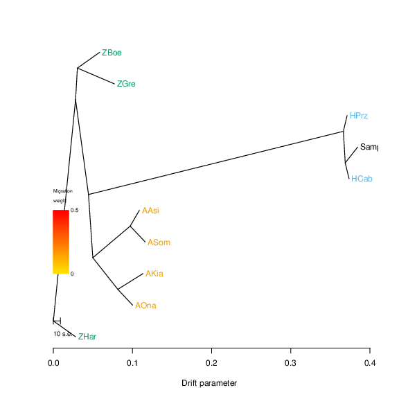
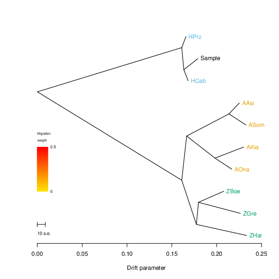
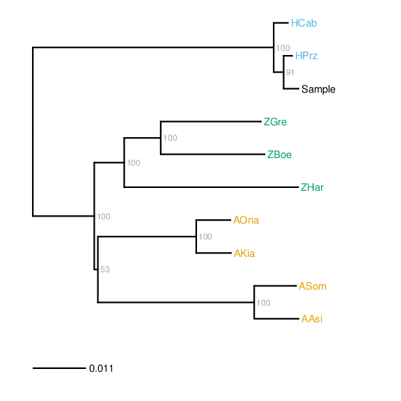

.. highlight:: Yaml
.. _zonkey_usage:

Pipeline usage
==============

The Zonkey pipeline is run on the command-line using the command 'paleomix zonkey', which gives access to a handful of commands:

.. code-block:: bash

    $ paleomix zonkey
    USAGE:
    paleomix zonkey run <panel> <sample.bam> [<destination>]
    paleomix zonkey run <panel> <nuclear.bam> <mitochondrial.bam> <destination>
    paleomix zonkey run <panel> <samples.txt> [<destination>]
    paleomix zonkey dryrun <panel> [...]
    paleomix zonkey mito <panel> <destination>

Briefly, it is possible to run the pipeline on a single sample by specifying the location of `BAM alignments`_ against the Equus caballus reference nuclear genome (equCab2, see `UCSC`_), and / or against the horse mitochondrial genome (using either the standard mitochondrial sequence NC\_001640.1, see `NCBI`_, or a mitochondrial genome of one of the samples included in the reference panel, as described below). The individual commands allow for different combinations of alignment strategies:

**paleomix zonkey run <panel> <sample.bam> [<destination>]**
    Runs the Zonkey pipeline on a single BAM alignment <sample.bam>, which is expected to contain a nuclear and / or a mitochondrial alignment. If <destination> is specified, a directory at that location is created, and the resulting output saved there. If <destination> is not specified, the default location is chosen by replacing the file-extension of the alignment file (typically '.bam') with '.zonkey'.

**paleomix zonkey run <panel> <nuclear.bam> <mitochondrial.bam> <destination>**
    This commands allow for the combined analyses of the nuclear and mitochondrial genomes, in cases where these alignments have been carried out seperately. In this case, specifying a <destination> location is madatory.

**paleomix zonkey run <panel> <samples.txt> [<destination>]**
    It is possible to run the pipeline on multiple samples at once, by specifying a list of BAM files (here <samples.txt>), which lists a sample name and one or two BAM files per line, with each column seperated by tabs). A destination may (optionally) be specified, as when specifying a single BAM file (see above).

**paleomix zonkey dryrun <panel> [...]**
    The 'dryrun' command is equivalent to the 'run' command, but does not actually carry out the analytical steps; this command is useful to test for problems before excuting the pipeline, such as missing or outdated software requirements (see :ref:`zonkey_requirements`).

**paleomix zonkey mito <panel> <destination>**
    The 'mito' command is included to create a :ref:`bam_pipeline` project template for mapping FASTQ reads against the mitochondrial genomes of the samples included in the Zonkey reference panel samples (see Prerequisites below) for a list of samples).

These possibilities are described in further detail below.

Prerequisites
-------------

All invocations of the Zonkey pipeline takes the path to a `panel` file as their first argument. This file contains the SNP panel necessary for performing hybrid identification and currently includes representatives of all extant equid species. For a more detailed description of the reference panel, and instructions for where to download the latest version of the file, please refer to the :ref:`zonkey_panel` section.

Secondly, the pipeline requires either one or two BAM files per sample, representing alignments against nuclear and / or mitochondrial genomes as described above. The analyses carried out by the Zonkey pipeline depends on the contents of the BAM alignment file provided for a given sample, and are presented below.

Single sample analysis
----------------------

For a single sample, the pipeline may be invoked by providing the path to the reference panel file followed by the path to one or two BAM files belonging to that sample, as well as an (mostly optional) destination directory.

For these examples, we will assume that the reference panel is saved in the file 'database.tar', that the BAM file 'nuclear.bam' contains an alignment against the equCab2 reference genome, that the BAM file 'mitochondrial.bam' contains an alignment against the corresponding mitochondrial reference genome (Genbank Accession Nb. NC_001640.1), and that the BAM file 'combined.bam' contains an alignment against both the nuclear and mitochondrial genomes. If so, the pipeline may be invoked as follows:

.. code-block:: bash

    # Case 1a: Analyse nuclear genome; results are placed in 'nuclear.zonkey'
    $ paleomix zonkey run database.tar nuclear.bam
    # Case 1b: Analyse nuclear genome; results are placed in 'my_results'
    $ paleomix zonkey run database.tar nuclear.bam my_results

    # Case 2b: Analyse mitochondrial genome; results are placed in 'mitochondrial.zonkey'
    $ paleomix zonkey run database.tar mitochondrial.bam
    # Case 2b: Analyse mitochondrial genome; results are placed in 'my_results'
    $ paleomix zonkey run database.tar mitochondrial.bam my_results

    # Case 3: Analyses both nuclear and mitochondrial genome, placing results in 'my_results'
    $ paleomix zonkey run database.tar nuclear.bam mitochondrial.bam my_results

    # Case 4a: Analyses both nuclear and mitochondrial genome; results are placed in 'combined.zonkey'
    $ paleomix zonkey run database.tar combined.bam
    # Case 4b: Analyses both nuclear and mitochondrial genome; results are placed in 'my_results'
    $ paleomix zonkey run database.tar combined.bam my_results

.. note::

	The filenames used here are have been chosen purely to illustrate each operation, and do not affect the operation of the pipeline.

As shown above, the pipeline will place the resulting output files in a directory named after the input file by default. This behavior, however, can be overridden by the user by specifying a destination directory (cases 1b, 2b, and 4b). When specifying two input files, however, it is required to manually specify the directory in which to store output files (case 3).

The resulting report may be accessed in the output directory under the name 'report.html', which contains summary statistics and figures for the analyses performed for the sample. The structure of directory containing the output files is described further in the :ref:`zonkey_filestructure` section.

Multi-sample analysis
---------------------

As noted above, it is possible to analyze multiple, different samples in one go. This is accomplished by providing a text file containing a tab separated table of samples, with columns separated by tabs. The first column in this table specifies the name of the sample, while the second and third column specifies the location of one or two BAM alignments associated with that sample. The following example shows one such file corresponding to cases 1 - 4 described above.

.. code-block:: bash

    $ cat samples.txt
    case_1	nuclear.bam
    case_2	mitochondrial.bam
    case_3	nuclear.bam mitochondrial.bam
    case_4	combined.bam

Processing of these samples is then carried out as shown above:

.. code-block:: bash

    # Case 5a) Analyse 3 samples; results are placed in 'samples.zonkey'
    $ paleomix zonkey run database.tar samples.txt
    # Case 5b) Analyse 3 samples; results are placed in 'my_results'
    $ paleomix zonkey run database.tar samples.txt my_results

The resulting directory contains a 'summary.html' file, providing an overview of all samples processed in the analyses, with link to the individual, per-sample, reports, as well as a sub-directory for each sample corresponding to that obtained from running individual analyses on each of the samples. The structure of directory containing the output files is further described in the :ref:`zonkey_filestructure` section.

.. note:
    Note that only upper-case and lower-case letters (a-z, and A-Z), as well as numbers (0-9), and underscores (_) are allowed in sample names.

Rooting TreeMix trees
---------------------

By default, the Zonkey pipeline does not attempt to root TreeMix trees; this is because the out-group specified *must* form a monophyletic clade; if this is not the case (e.g. if the clade containing the two reference horse samples becomes paraphyletic due to the test sample nesting with one of them), TreeMix will fail to run to completion.

Therefore it may be preferable to run the pipeline without specifying an outgroup, and then specifying the outgroup, in a second run, once the placement of the sample is done. This is accomplished by specifying these using the --treemix-outgroup command-line option, specifying the samples forming the out-group as a comma-separated list. For example, assuming that the following TreeMix tree was generated for our sample:

If so, we may wish to root on the caballine specimen (all other command-line arguments omitted for simplicity):

.. code-block:: bash

    $ paleomix zonkey run ... --treemix-outgroup Sample,HPrz,HCab

This yields a tree rooted using this group as the outgroup:

.. note::

    Rooting of the tree will be handled automatically in future versions of the Zonkey pipeline.

Mapping against mitochondrial genomes
-------------------------------------

In order to identify the species of the sire and dam, respectively, for F1 hybrids, the Zonkey pipeline allows for the construction of a maximum likelihood phylogeny using RAxML [Stamatakis2006]_ based on the mitochondrial genomes of reference panel (see Prerequisites, above) and a consensus sequence derived from the mitochondrial alignment provided for the sample being investigated.

The resulting phylogeny is presented rooted on the mid-point:

As noted above, this requires that the the sample has been mapped against the mitochondrial reference genome NC\_001640.1 (see `NCBI`_), corresponding to the 'MT' mitochondrial genome included with the equCab2 reference sequence (see `UCSC`_). In addition, it is possible to carry out mapping against the mitochondrial genomes of the reference panel used in the Zonkey reference panel, by using the :ref:`bam_pipeline`.

This is accomplished by running the Zonkey 'mito' command, which writes a simple BAM pipeline makefile template to a given directory, along with a directory containing the FASTA sequences of the reference mitochondrial genomes::

    $ paleomix zonkey mito database.tar output_folder/

Please refer to the :ref:`bam_pipeline` documentation if you wish to use the BAM pipeline to perform the mapping itself. Once your data has been mapped against either or all of these mitochondrial genomes, the preferred BAM file (e.g. the alignment with the highest coverage) may be included in the analyses as described above.

.. _NCBI: https://www.ncbi.nlm.nih.gov/nuccore/5835107
.. _UCSC: https://genome.ucsc.edu/cgi-bin/hgGateway?clade=mammal&org=Horse&db=0
.. _BAM alignments: http://samtools.github.io/hts-specs/SAMv1.pdf
